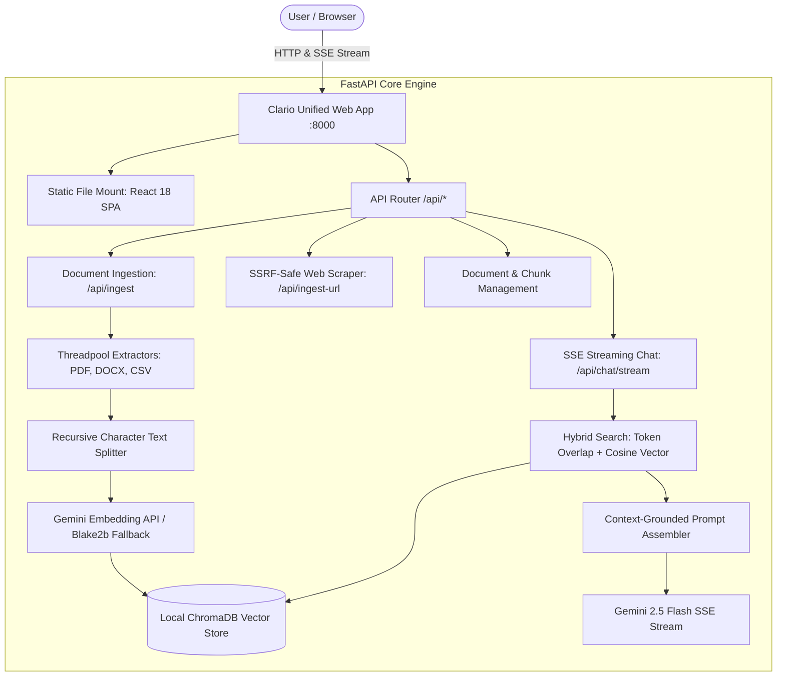

# Clario 🤖

[](https://fastapi.tiangolo.com/)
[](https://react.dev/)
[](https://www.trychroma.com/)
[](https://aistudio.google.com/)
[](https://www.docker.com/)
[](https://github.com/shibiliCM/clario/actions/workflows/ci.yml)
[](LICENSE)

**Clario** is a production-grade, local-first Retrieval-Augmented Generation (RAG) assistant designed for document research, hybrid lexical/semantic search, and grounded question answering with Google Gemini 2.5 Flash.

It runs as a **unified, single-port service** where FastAPI directly serves both the compiled React single-page application and high-performance REST/SSE API endpoints.

---

## ✨ Key Features

- ⚡ **Real-Time SSE Streaming**: Word-by-word streaming generation directly from Gemini with an active stop button.
- 📱 **Fully Mobile Responsive**: Off-canvas slide-over drawer with backdrop dismiss, safe-area adaptation, and touch-optimized controls.
- 🔍 **Hybrid Retrieval Engine**: Fuses exact lexical token matching with dense semantic cosine similarity in ChromaDB for superior accuracy.
- 🛡️ **Zero Hallucination Grounding**: Enforces strict system constraints that require the assistant to answer only using retrieved document context and explicitly cite sources.
- 📁 **Multi-Format Extraction**: Ingests PDF (`pdfplumber`), Word (`python-docx`), CSV spreadsheets, TXT, and Markdown files.
- 🌐 **SSRF-Protected Web Scraping**: Ingests web articles with automated DNS checks and redirect re-validation that blocks private, loopback, or cloud metadata addresses.
- 🔒 **Client-Side Key Flexibility**: Configure your `GEMINI_API_KEY` on the server or allow users to supply their own key directly in the UI Settings modal.
- 🧪 **Automated Testing & CI**: Comprehensive unit test suite with automated GitHub Actions workflows for continuous integration.
- 🚀 **1-Click Live Deployment**: Zero-config blueprints included for **Render** (`render.yaml`) and **Railway** (`railway.json`).

---

## 🏗️ Architecture



---

## 🚀 Live Cloud Deployment

### Deploy on Render (Recommended & Free)

[](https://render.com)

1. Fork or push this repository to GitHub.
2. In the [Render Dashboard](https://dashboard.render.com/), click **New +** → **Blueprint**.
3. Select your repository. Render automatically reads [`render.yaml`](render.yaml).
4. Set the environment variable `GEMINI_API_KEY` with your free key from [Google AI Studio](https://aistudio.google.com/).
5. Click **Apply**. Your app will be live at `https://<your-service>.onrender.com`.

### Deploy on Railway

1. In [Railway.app](https://railway.app/), click **New Project** → **Deploy from GitHub repo**.
2. Select your repository (Railway automatically detects [`railway.json`](railway.json) and [`Dockerfile`](rag-chatbot-free-tier/rag-chatbot/Dockerfile)).
3. Add the environment variable `GEMINI_API_KEY`.
4. In Settings → Networking, click **Generate Domain**.

---

## 💻 Local Quickstart

### Prerequisites
- Python 3.11+
- Node.js 18+ (only if editing frontend)
- Free Gemini API Key from [Google AI Studio](https://aistudio.google.com/)

### 1. Launch with PowerShell (Windows)
```powershell
cd rag-chatbot-free-tier\rag-chatbot
.\start_backend.ps1
```
Open **`http://localhost:8000`** in your browser.

### 2. Manual Command Line
```powershell
cd rag-chatbot-free-tier\rag-chatbot\backend

# Activate virtual environment
.\.venv\Scripts\activate

# Run FastAPI unified server
python -m uvicorn rag_chatbot:app --host 0.0.0.0 --port 8000 --reload
```
Open **`http://localhost:8000`**.

### 3. Run with Docker
```bash
cd rag-chatbot-free-tier/rag-chatbot
docker build -t clario .
docker run -p 8000:8000 -e GEMINI_API_KEY="your_api_key_here" clario
```

### 4. Run Automated Tests
```powershell
cd rag-chatbot-free-tier\rag-chatbot\backend
python -m unittest discover tests
```

---

## 📋 API Route Reference

| Method | Endpoint | Description |
|---|---|---|
| `POST` | `/api/chat/stream` | **Server-Sent Events** streaming chat with citations. |
| `POST` | `/api/chat` | Standard JSON grounded chat endpoint. |
| `POST` | `/api/ingest` | Multipart file upload (`.pdf`, `.docx`, `.csv`, `.txt`, `.md`). |
| `POST` | `/api/ingest-url` | SSRF-safe URL scraper and article chunker. |
| `GET` | `/api/documents` | Lists all indexed sources and chunk counts. |
| `DELETE` | `/api/documents` | Deletes a document and its embeddings from ChromaDB. |
| `GET` | `/api/health` | Health diagnostic status (API version, ChromaDB chunks, Gemini status). |
| `GET` | `/docs` | Interactive Swagger API documentation. |
| `GET` | `/` | Serves compiled React single-page application. |

---

## ⚙️ Environment Variables

Copy `rag-chatbot-free-tier/rag-chatbot/backend/.env.example` to `backend/.env`:

| Variable | Default | Description |
|---|---|---|
| `GEMINI_API_KEY` | *(Required)* | Google Gemini API key from AI Studio. |
| `LLM_MODEL` | `gemini-2.5-flash` | Gemini model for chat completion. |
| `EMBED_MODEL` | `gemini-embedding-001` | Model for vector embeddings. |
| `CHUNK_SIZE` | `800` | Word count per document chunk. |
| `CHUNK_OVERLAP` | `150` | Word overlap between adjacent chunks. |
| `TOP_K_RESULTS` | `5` | Maximum passage chunks retrieved per query. |
| `MAX_FILE_SIZE_BYTES` | `31457280` | Maximum file upload size in bytes (30MB). |
| `PORT` | `8000` | Server listening port. |

---

## 📄 License

This project is licensed under the MIT License.
