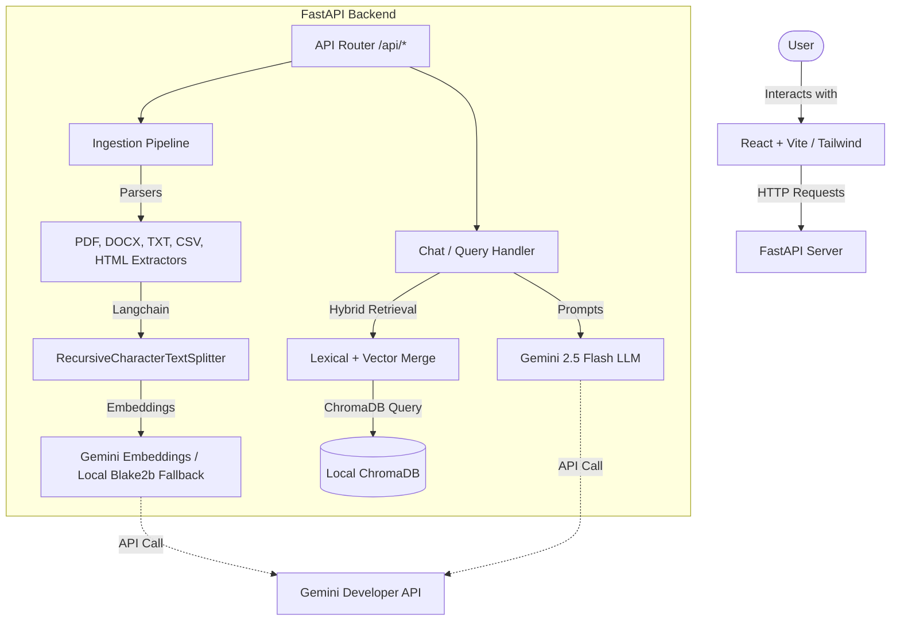

# Clario 🤖

Clario is a lightweight, local document assistant that enables users to upload files, build a searchable knowledge base, and chat with their documents using Retrieval-Augmented Generation (RAG). It leverages Gemini 2.5 Flash for chat responses and falls back to robust local embeddings if API connectivity is restricted.

---

## 🏗️ Architecture Overview

Clario follows a client-server architecture separating a reactive frontend from a performance-oriented FastAPI backend.



### Key Architectural Layers

1. **Frontend (Presentation Layer):** A modern React single-page application built on Vite and Tailwind CSS. It communicates with the backend asynchronously, handles file uploads with progress monitoring, and maintains local chat session history.
2. **Backend (Application Layer):** A FastAPI server serving REST endpoints. It orchestrates document parsing, chunking, vector embedding generation, query matching, and prompt engineering.
3. **Database (Storage Layer):** A local **ChromaDB** vector database storing document chunks, metadata, and high-dimensional vectors for semantic search.
4. **LLM & Embedding Provider:** Integrates with Google's **Gemini API** for high-quality text embeddings and generative conversation.

---

## ⚡ How It Works (RAG Flow)

```
[Upload Document/URL] ➔ [Extract Text] ➔ [Chunk Text] ➔ [Generate Embeddings] ➔ [Store in ChromaDB]
                                                                                        │
[User Query] ➔ [Query Embeddings] ➔ [Hybrid Lexical & Vector Search] ➔ [Retrieve Chunks] ◄┘
      │
      ▼
[Build Context-Rich Prompt] ➔ [Query LLM (Gemini)] ➔ [Structure grounded Answer]
```

1. **Ingestion Pipeline:**
   - **Parsing:** Extracted text from PDF, DOCX, TXT, MD, and CSV. Web scraping uses BeautifulSoup4.
   - **Chunking:** Documents are split into overlapping segments using LangChain's `RecursiveCharacterTextSplitter` based on character/token count.
   - **Embedding:** Chunks are sent to the Gemini API (`gemini-embedding-001`) to generate embeddings. If Gemini is unconfigured or offline, a local fallback hashing-vectorizer (Blake2b) generates embeddings.
   - **Storage:** Embedded chunks are index-stored in a local ChromaDB collection using cosine similarity metric.

2. **Hybrid Search Retrieval:**
   - On user query, Clario executes a **hybrid retrieval** process:
     - **Lexical Search:** Evaluates TF-IDF-like overlap scores on tokenized text.
     - **Semantic Search:** Embeds the query and queries ChromaDB for the closest vector matches.
   - The hits from both retrievals are deduplicated and merged using score-based sorting.

3. **Grounded Generation:**
   - Clario builds a system prompt containing the query, chat history, and retrieved document context.
   - The prompt instructs Gemini to answer **only** using the provided context and avoid making up information, citing the specific source document name.

---

## 🛠️ Technology Stack

| Component | Technology | Role |
| --- | --- | --- |
| **Frontend** | React 18, Vite | Single-page Application Framework |
| **Styling** | Tailwind CSS, Lucide React | Modern Responsive UI & Icons |
| **API Client** | Axios, React Markdown | Requests & Markdown rendering |
| **Backend** | FastAPI, Uvicorn | High-performance Web server |
| **Database** | ChromaDB (local) | Vector storage and indexing |
| **Extractors** | PDFPlumber, Python-Docx, BeautifulSoup4 | Text extraction from documents & URLs |
| **NLP Utilities**| LangChain Text Splitters | Text chunking and parsing |
| **AI Models** | Gemini 2.5 Flash, Gemini Embeddings | LLM and text embeddings |

---

## 🚀 Setup & Installation

### Prerequisites
- Python 3.11+
- Node.js 18+
- Gemini API Key ([Get one here](https://aistudio.google.com/))

### 1. Configure the Environment

Create or edit `backend/.env`:

```env
# Required API Key
GEMINI_API_KEY=your_gemini_api_key_here

# Optional Configurations (with default values)
CHUNK_SIZE=800
CHUNK_OVERLAP=150
TOP_K_RESULTS=5
LLM_MODEL=gemini-2.5-flash
EMBED_MODEL=gemini-embedding-001
VECTOR_STORE_PATH=./vector_store
```

### 2. Start the Backend Server

From the project root directory, run the PowerShell helper script:

```powershell
.\start_backend.ps1
```

This will automatically create a Python virtual environment, install requirements, and start the FastAPI server at `http://localhost:8000`.

### 3. Start the Frontend Dev Server

In a new PowerShell window, run the frontend helper script:

```powershell
.\start_frontend.ps1
```

This will run `npm install` and launch the Vite development server. Open `http://localhost:5173` in your browser.

---

## 🔌 API Endpoints

| Method | Endpoint | Description |
| --- | --- | --- |
| **GET** | `/api/health` | Server and knowledge base health status |
| **GET** | `/api/documents` | List all ingested documents and their chunk counts |
| **POST** | `/api/ingest` | Upload one or more documents (PDF, DOCX, TXT, MD, CSV) |
| **POST** | `/api/ingest-url` | Ingest and scrape a web page URL |
| **POST** | `/api/chat` | Ask questions with context grounding and session history |
| **DELETE** | `/api/documents` | Remove a document and its chunks from the database |

---

## 🤝 Acknowledgments & Credits

- [Google Gemini API](https://ai.google.dev/) for providing high-speed, cost-effective embeddings and inference models.
- [ChromaDB](https://www.trychroma.com/) for a lightweight, zero-configuration local vector database.
- [FastAPI](https://fastapi.tiangolo.com/) for the robust, asynchronous Python web API framework.
- [Tailwind CSS](https://tailwindcss.com/) and [Lucide Icons](https://lucide.dev/) for the clean design and UI icons.
- [Vite](https://vitejs.dev/) for the ultra-fast frontend build tooling.
