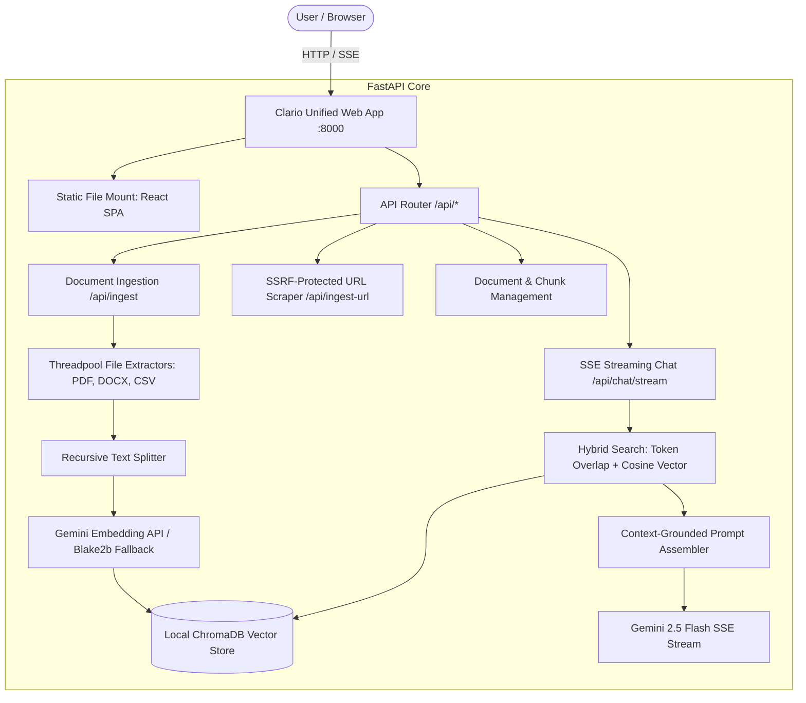

# Clario — Production RAG Document Assistant Walkthrough

Clario is an AI-powered, local-first document research assistant built with **FastAPI**, **React 18 / Vite**, **ChromaDB**, and **Google Gemini 2.5 Flash**. It provides real-time Server-Sent Events (SSE) streaming, hybrid lexical + semantic retrieval, SSRF-safe URL scraping, and multi-format document ingestion (PDF, Word, CSV, TXT, Markdown).

---

## 🏗️ Architecture Overview

Clario runs as a **unified, single-port service**. In production, FastAPI serves the compiled React application directly from `/`, while handling all REST and SSE endpoints under `/api/*`.



---

## 🚀 Live Cloud Deployment (Render & Railway)

### Option A: 1-Click Deploy on Render (Recommended)

1. Push this repository to your GitHub account.
2. Log into [Render Dashboard](https://dashboard.render.com/).
3. Click **New +** → **Blueprint**, and select your repository (Render automatically detects [render.yaml](file:///c:/DS/projects/clario/render.yaml)).
4. Alternatively, click **New +** → **Web Service**:
   - **Environment**: Docker
   - **Dockerfile Path**: `rag-chatbot-free-tier/rag-chatbot/Dockerfile`
   - **Context**: `rag-chatbot-free-tier/rag-chatbot`
   - **Instance Type**: Free
5. Set Environment Variable in Render Dashboard:
   - `GEMINI_API_KEY`: _(Your Google Gemini API key from AI Studio)_
6. Click **Deploy**. Your app will be live at `https://<your-service>.onrender.com`!

### Option B: Railway Deployment

1. Log into [Railway.app](https://railway.app/).
2. Click **New Project** → **Deploy from GitHub repo**.
3. Select your repository. Railway automatically reads [railway.json](file:///c:/DS/projects/clario/railway.json).
4. Add the environment variable `GEMINI_API_KEY`.
5. Railway will automatically build the multi-stage Docker image and provide a live public HTTPS URL.

### Option C: Local / VPS Docker

```bash
cd rag-chatbot-free-tier/rag-chatbot
docker build -t clario .
docker run -p 8000:8000 -e GEMINI_API_KEY="your_api_key" clario
```

Open **`http://localhost:8000`** in your browser.

---

## 💻 Local Development Workflow

To develop locally with live hot-reloading:

### 1. Backend Server

```powershell
cd rag-chatbot-free-tier\rag-chatbot\backend
# Activate virtual environment
.\.venv\Scripts\activate
# Start FastAPI backend
python -m uvicorn rag_chatbot:app --host 0.0.0.0 --port 8000 --reload
```

### 2. Frontend Development Server (Optional for Dev Hot-Reload)

```powershell
cd rag-chatbot-free-tier\rag-chatbot\frontend
npm install
npm run dev
```

Open **`http://localhost:5173`** (Vite proxies all `/api` calls directly to port 8000).

### 3. Run Automated Unit Tests

```powershell
cd rag-chatbot-free-tier\rag-chatbot\backend
python -m unittest discover tests
```

---

## 🛡️ Production & Security Enhancements

1. **Server-Side Request Forgery (SSRF) Protection**:
   - `_validate_safe_url` in [rag_chatbot.py](file:///c:/DS/projects/clario/rag-chatbot-free-tier/rag-chatbot/backend/rag_chatbot.py) resolves DNS hostnames and strictly blocks loopbacks (`127.0.0.1`, `localhost`), internal private subnets (`10.0.0.0/8`, `172.16.0.0/12`, `192.168.0.0/16`), and cloud link-local metadata addresses (`169.254.169.254`).
2. **CPU-Bound Thread Offloading**:
   - Document parsers (`pdfplumber`, `python-docx`, `csv`) are wrapped in `asyncio.to_thread(...)`, keeping the asyncio event loop unblocked for high-concurrency requests.
3. **Payload & File-Size Limits**:
   - Ingestion enforces a default `MAX_FILE_SIZE_BYTES` (30MB) to prevent memory exhaustion and DoS attacks.
4. **Real-Time Streaming Responses (SSE)**:
   - Real-time token streaming via Server-Sent Events (`POST /api/chat/stream`) provides immediate visual feedback to users with an active stop button.
5. **No Domain-Specific Hardcoding**:
   - Generic, high-fidelity RAG prompt templates and bulleted extract formatting handle any domain cleanly (finance, healthcare, engineering, legal, research).
6. **Flexible Client API Key Override**:
   - Users or visitors can optionally supply their own `GEMINI_API_KEY` via the UI Settings modal without modifying the server's `.env`.

---

## 📋 API Route Reference

| Method   | Endpoint           | Description                                                              |
| -------- | ------------------ | ------------------------------------------------------------------------ |
| `POST`   | `/api/chat/stream` | **Server-Sent Events** real-time streaming chat endpoint with citations. |
| `POST`   | `/api/chat`        | Standard JSON grounded chat endpoint.                                    |
| `POST`   | `/api/ingest`      | Multipart file upload (`.pdf`, `.docx`, `.csv`, `.txt`, `.md`).          |
| `POST`   | `/api/ingest-url`  | SSRF-safe web scraper and article chunker.                               |
| `GET`    | `/api/documents`   | Lists all indexed sources and chunk counts.                              |
| `DELETE` | `/api/documents`   | Deletes a document and its embeddings from ChromaDB.                     |
| `GET`    | `/api/health`      | Diagnostic status (API version, ChromaDB chunks, Gemini status).         |
| `GET`    | `/docs`            | Interactive Swagger API documentation.                                   |
| `GET`    | `/`                | Serves compiled React single-page application.                           |
